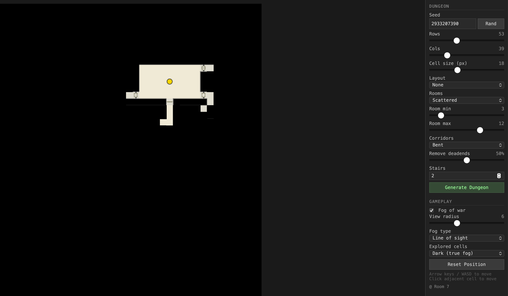

# Solo Dungeon Explorer

A browser-based random dungeon generator for solo tabletop RPG play. No server, no install — open `solo-dungeon.html` directly.

[▶ Play in Browser](https://acyed.github.io/Solo-Dungeon-Generator/solo-dungeon.html)

## Features

- **Random dungeon generation** — rooms, corridors, doors (arch/locked/trapped/secret/portcullis), and stairs
- **Player token** — move with arrow keys, WASD, or click an adjacent cell
- **Fog of war** — reveals as you explore
  - *Radius mode*: see everything within N cells
  - *Line-of-sight mode*: walls block vision
- **Explored cell display** — dim (greyed out) or dark (true fog)
- **Fully configurable** — seed, dungeon size, room layout, corridor style, deadend removal, stair count, cell size, and all fog settings

## Usage

1. Open `solo-dungeon.html` in any modern browser
2. Adjust dungeon settings in the sidebar
3. Click **Generate Dungeon**
4. Move with **arrow keys** or **WASD**
5. Click an adjacent cell to step there

## Credits

Dungeon generation algorithm ported from [donjon](http://donjon.bin.sh/) by drow, licensed under [CC BY-NC 3.0](http://creativecommons.org/licenses/by-nc/3.0/).
